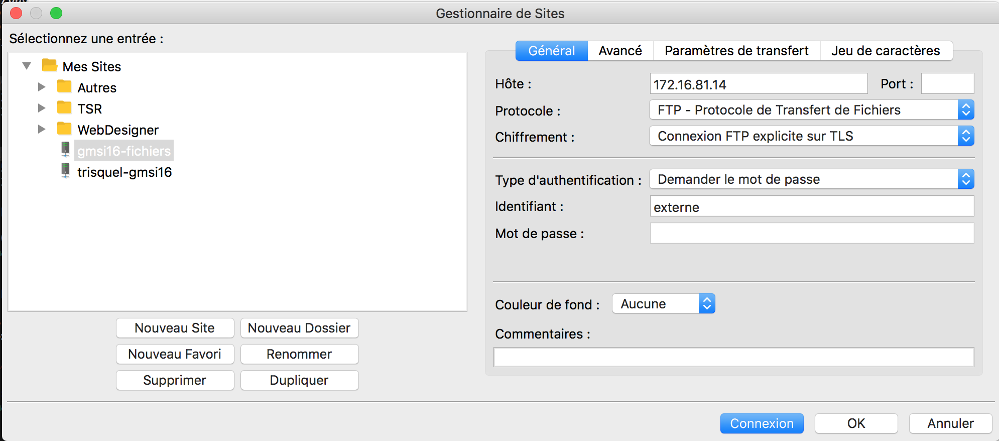
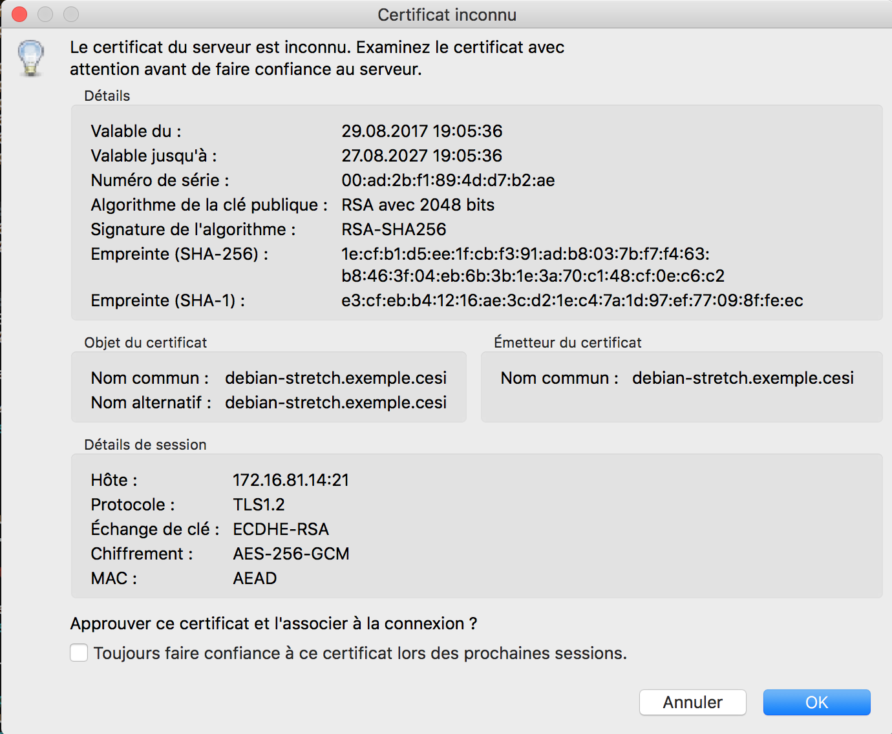
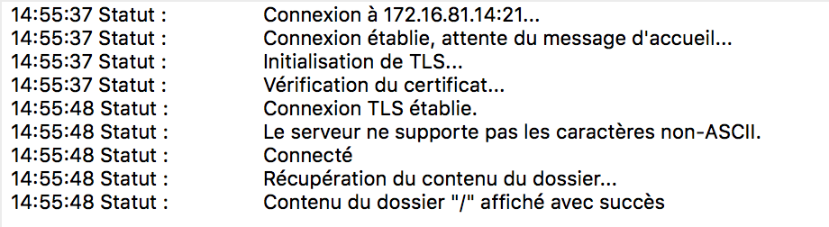

# Installation de VSFTP

## Introduction

VSFTP permet de sécuriser un serveur FTP en utilisant des protocoles SSL ou TLS

## Installation et configuration

### Installation

On utilise le gestionnaire de paquets:

```bash
sudo apt-get update && sudo apt-get -y install vsftpd openssl

```

### Génération des clefs

On vérifie que le répertoire de stockage des clefs existe:

(Ici on utilise l'alias `ll` qui remplace `ls -l`

```bash
ls -ld /etc/ssl/private
```

Vérifier que les droits sur ce répertoire sont bien `700`. Sinon, lancez la commande appropriée pour cela.

Et si le répertoire n'existe pas:

```bash
mkdir -p /etc/ssl/private
chmod 700 /etc/ssl/private
```

On crée maintenant la clef:

```bash
openssl req -x509 -nodes -days 365 -newkey rsa:1024 -keyout /etc/ssl/private/vsftpd_key.pem -out /etc/ssl/private/vsftpd.pem
Generating a 1024 bit RSA private key
....++++++
.....++++++
writing new private key to '/etc/ssl/private/vsftpd_key.pem'
-----
```

Il faut maintenant répondre aux questions suivantes:

```bash
You are about to be asked to enter information that will be incorporated
into your certificate request.
What you are about to enter is what is called a Distinguished Name or a DN.
There are quite a few fields but you can leave some blank
For some fields there will be a default value,
If you enter '.', the field will be left blank.
-----
Country Name (2 letter code) [AU]:FR
State or Province Name (full name) [Some-State]:<Entrer la région (Aquitaine)>
Locality Name (eg, city) []:<Entrer la ville (Pau)>
Organization Name (eg, company) [Internet Widgits Pty Ltd]:<ORGANISME DE FORMATION>
Organizational Unit Name (eg, section) []:<NOM DE LA FORMATION>
Common Name (e.g. server FQDN or YOUR name) []:exemple.com
Email Address []:<ENTRER VOTRE ADRESSE MAIL>
```

### Configuration de VSFTP

Le fichier `/etc/vsftpd.conf` permet de modifier différents éléments.

---

**Un mot sur les éditeurs de texte**

Le fichier à éditer étant dense, voici quelques astuces pour le modifier et surtout chercher des informations à l'intérieur.

On peut l'éditer avec `nano` et modifier les éléments indiqués ci-dessous. Pour naviguer dans `nano`, utiliser les raccourcis suivants:

    - `ctrl-W` : permet de rechercher une chaîne de caractères (`alt-W` permet de répéter la recherche)
    - `ctrl-G` : permet d'afficher l'aide
    - `ctrl-C` ou `F11` : affiche la position actuelle du curseur (utile pour connaître le numéro de ligne)
    - `ctrl-_` ou `Alt-G` : aller à la ligne n°...

Un autre éditer est `ne` (Nice Editor) et propose des raccourcis plus "standards" et l'accès à une barre de menu par la touche `Esc`. Il est installable via `apt-get`.

**Fin de la parenthèse sur les éditeurs de texte**

---

Changer les options suivantes (vérifier avec les fonctions de recherche si elles sont déjà présentes) :

```conf
# Activates SSL
ssl_enable=YES

# Allow anonymous users to use secured SSL connections
allow_anon_ssl=YES

# All non-anonymous logins are forced to use a secure SSL connection in order to
# send and receive data on data connections.
force_local_data_ssl=YES

# All non-anonymous logins are forced to use a secure SSL connection in order to send the password.
force_local_logins_ssl=YES

# Permit TLS v1 protocol connections. TLS v1 connections are preferred
ssl_tlsv1=YES

# Permit SSL v2 protocol connections. TLS v1 connections are preferred
ssl_sslv2=NO

# permit SSL v3 protocol connections. TLS v1 connections are preferred
ssl_sslv3=NO

# Disable SSL session reuse (required by WinSCP)
require_ssl_reuse=NO

# Select which SSL ciphers vsftpd will allow for encrypted SSL connections (required by FileZilla)
ssl_ciphers=HIGH

```
### Forçage des connexions TLS

En utilisant (ci-dessus) `force_local_logins_ssl=YES` et `force_local_data_ssl=YES`, alors seules les connexions TLS sont sécurisées.

Cela peut bloquer les utilisateurs ayant un ancien client FTP (qui ne supportent pas TLS), mais assure un meilleur niveau de sécurité.

En utilisant `force_local_logins_ssl=NO` and `force_local_data_ssl=NO` les connexions TLS et non-TLS seront autorisées, en fonction des capacités des clients FTP (mais cette option n'est pas recommandée si on souhaite sécuriser le serveur)

### Modification du certificat

Modifier les lignes suivantes:

```conf
rsa_cert_file=/etc/ssl/private/vsftpd.pem
rsa_private_key_file=/etc/ssl/private/vsftpd_key.pem
```


### Connexion avec les utilisateurs du système

Les options suivantes sont à définir afin de permettre les connexions des utilisateurs du système:

```conf
# Uncomment this to allow local users to log in.
local_enable=YES
#
# Uncomment this to enable any form of FTP write command.
write_enable=YES
#
# Default umask for local users is 077. You may wish to change this to 02$# if your users expect that (022 is used by most other ftpd's)
local_umask=022

```

### chroot des utilisateurs

Les utilisateurs pourront accéder uniquement à un seul répertoire depuis
leur client FTP. Ce répertoire de base pour vsftpd sera
`/srv/ftp/allusers`.

Il est important de créer ce répertoire sur le serveur.

Pour configurer ce répertoire, il sera nécessaire d’utiliser les deux
directives suivantes dans `/etc/vsftpd.conf`:

```conf
chroot_local_user=YES
local_root=/srv/ftp/allusers
```

### Redémarrage du service FTP

Le redémarrage se fait par la commande suivante:

```bash
sudo systemctl restart vsftpd
```

Si aucune erreur de configuration n'est présente, le service devrait démarrer sans erreur. On peut le vérifier par la commande suivante:

```bash
sudo systemctl status vsftpd
```

## Création d'un utilisateur

Nous allons créer un utilisateur et positionner son répertoire home dans `/var/ftproot`.

De plus, nous allons faire en sorte que cet utilisateur ne puisse se connecter sur ce serveur que au service FTP (il ne pourra pas se connecter directement via `ssh`). Ceci permet de sécuriser le serveur et d'éviter qu'un utilisateur FTP (qui peut être externe à l'organisation) ne puisse aussi se retrouver connecté au serveur en tant qu'utilisateur standard.

Nous allons donc créer un utilisateur nommé `externe`

```bash
#On crée le répertoire s'il n'existe pas:
mkdir /var/ftproot

#On ajoute l'utilisateur:
adduser --disabled-login --shell /bin/false --home /var/ftproot/externe externe
```

Cette dernière commande demandera des détails:

```bash
$ adduser --disabled-login --shell /bin/false --home /var/ftproot/externe externe
Adding user 'externe' ...
Adding new group 'externe' (1001) ...
Adding new user 'externe' (1001) with group 'externe' ...
Creating home directory '/var/ftproot/externe' ...
Copying files from '/etc/skel' ...
Changing the user information for externe
Enter the new value, or press ENTER for the default
	Full Name []:
	Room Number []:
	Work Phone []:
	Home Phone []:
	Other []:
Is the information correct? [Y/n]
```

On répond `y` (ou on appuie directement sur entrée, sachant que la lettre en majuscule désigne l'option par défaut).

Pour éviter d'avoir à répondre à toutes ces questions on aurait pu aussi écrire la commande suivante:

```bash
sudo adduser --gecos ',,,,' --disabled-login --shell /bin/false --home /var/ftproot/externe externe
#gecos permet de remplir automatiquement les champs `Full Name`, `Room Number`, etc. Chaque champ est séparé par une virgule.
```


## Connexion avec Filezilla

Ouvrir le gestionnaire de session:


La fenêtre suivante apparaît:



Créer une session avec le bouton "Nouveau site" et définir les champs suivants:

- Hôte: l'IP de l'hôte
- Protocole: FTP
- Chiffrement: connexion FTP explicite sur TLS
- Type d'authentification: demander le mot de passe
- Identifiant: externe


Cliquer ensuite sur "Connexion".

La fenêtre suivante apparaît:



Examiner attentivement les informations et cliquer sur OK.

La connexion devrait se faire et afficher le contenu du répertoire:



### Tests

Essayer de créer un répertoire depuis Filezilla. Que se passe-t-il ? Comment faire pour permettre la création d'un répertoire ?

**Attention**

Il est interdit d'utiliser `chmod 777 ...`

Il existe d'autres possibilités pour cela, et notamment l'utilisation du groupe `ftp`.

Il faut donc trouver une manière de rendre le répertoire `/srv/ftp/allusers` inscriptible par les utilisateurs du serveur FTP avec ces contraintes.

### En cas d'erreur

En cas d'erreur `Erreur GnuTLS -15: An unexpected TLS packet was received.`


Vérifier que le répertoire désigné par la variable `local_root` existe.

Sinon:

```bash
sudo mkdir -p /srv/ftp/allusers
```

Cette erreur peut aussi être due au refus de VSFTP de laisser le répertoire utilisateur avec les droits en écriture. Dans ce cas, rajouter cette ligne pour l'autoriser:

```conf
allow_writeable_chroot=YES
```
